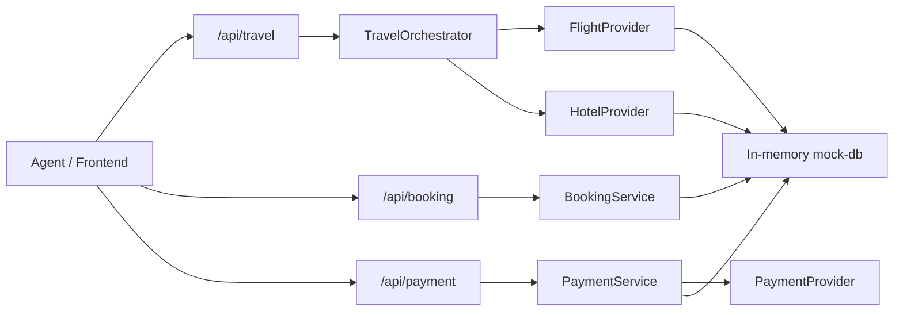

# Anna 项目总目录

## Anna Controlled Personal Assistant Backend

本目录已新增一套生产级方向的受控个人助理后端骨架，目标是让 Anna 主体通过注册工具完成浏览器自动化、机票酒店查询辅助、Mac 端 Shortcuts 操作和后续 Python 沙箱任务，而不是让大模型直接无限制控制电脑。

核心目录：

```text
apps/web-client
apps/admin-panel
services/api-server
services/agent-server
services/worker
services/sandbox-runner
packages/agent-core
packages/policy-engine
packages/approval-engine
packages/tool-registry
packages/browser-tools
packages/mac-tools
packages/booking-tools
packages/payment-tools
packages/audit-logger
packages/shared
infra/docker
docs
```

安全链路：

```text
task request -> tool-registry schema -> policy-engine -> approval-engine if needed -> audit-logger -> tool handler
```

第一版已注册工具：

- `browser.open`
- `browser.click`
- `browser.type`
- `browser.screenshot`
- `mac.shortcut.run`
- `booking.search`
- `payment.capture`，该工具仅作为禁止项占位，策略引擎会拒绝。

### 运行受控后端

本机如果没有 `pnpm`，先启用 Corepack 或通过 `npx` 使用：

```bash
corepack enable
corepack prepare pnpm@9.15.4 --activate
```

安装依赖：

```bash
corepack pnpm install
```

启动 PostgreSQL 和 Redis：

```bash
docker compose -f infra/docker/docker-compose.yaml up -d
```

配置环境变量：

```bash
cp .env.example .env
```

如果要允许 Anna 调用 Mac Shortcuts，只把你手动创建并确认安全的 Shortcut 名称写入：

```text
ANNA_ALLOWED_SHORTCUTS=Open Notes,Start Focus Mode
```

构建并启动受控 API：

```bash
corepack pnpm run build:controlled-assistant
corepack pnpm run start:controlled-api
```

默认地址是 `http://127.0.0.1:4318`：

```bash
curl http://127.0.0.1:4318/health
curl http://127.0.0.1:4318/v1/tools
```

创建一个低风险浏览器打开任务：

```bash
curl -s http://127.0.0.1:4318/v1/tasks \
  -H 'content-type: application/json' \
  -H 'x-user-id: local-user' \
  -d '{"toolId":"browser.open","input":{"url":"https://example.com","sessionId":"demo"}}'
```

创建一个需要审批的点击任务：

```bash
curl -s http://127.0.0.1:4318/v1/tasks \
  -H 'content-type: application/json' \
  -H 'x-user-id: local-user' \
  -d '{"toolId":"browser.click","input":{"selector":"a","sessionId":"demo"}}'
```

返回 `approval.id` 后再确认：

```bash
curl -s http://127.0.0.1:4318/v1/approvals/APPROVAL_ID/confirm \
  -H 'content-type: application/json' \
  -H 'x-user-id: local-user' \
  -d '{"reason":"I approve this browser click."}'
```

查看审计：

```bash
curl http://127.0.0.1:4318/v1/audit-logs
```

架构和安全边界见：

- `docs/architecture.md`
- `docs/security-policy.md`
- `docs/agent-tooling-research.md`

Anna App 对接时请先按官方指南检查本机环境：

```bash
node --version
uv --version
anna-app doctor
```

后续导入 Anna 主体时，建议通过 `app.json` 的 `bundled_executas`、`manifest.json` 的 `required_executas` 和最小化 `ui.host_api` 暴露这套受控后端，再运行：

```bash
anna-app validate --strict
```

我没有在本阶段调用真实 Anna 平台 API；如果下一步需要 `anna-app login`、`anna-app dev`、`anna.tools.invoke` 或任何 Anna 平台接口，我会先问你确认。

Anna Dashboard 地址是 [https://anna.partners/dashboard](https://anna.partners/dashboard)。本项目当前仍只在本地个人助理模式中开发和验证；进入 Dashboard、登录、发布、绑定真实项目或调用平台 API 都需要你下一步明确授权。

### Anna `/matrix` 本地命令入口

Anna 个人助理主体项目新增了本地 Matrix 命令面板：

```bash
cd 08-personal-assistant-anna-app
npm run serve
```

然后打开：

```text
http://127.0.0.1:8808/matrix
```

它只能启动固定 allowlist 命令：

- `controlled-api.build`
- `controlled-api.start`
- `python-agent.validate`
- `python-agent.start`

这个入口不会接受任意 shell 命令，不运行 `sudo`，不读取钥匙串，不做付款或下单。

### Python/FastAPI 受控 Agent 骨架

根据新的 Computer Agent 目标，另在 `services/agent-server/python_agent` 增加了 Python/FastAPI 第一阶段安全骨架，包含：

- `.env.example`：默认安全配置模板。
- `settings.py`：读取 `.env.local` / `.env` 的配置入口。
- `validate_config.py`：启动前安全检查。
- `policy.yaml`：允许、需要审批、禁止的工具策略。
- `allowlist.json`：Mac Shortcuts 白名单。
- `policy.py`：权限判断逻辑。
- `approval.py`：人工确认记录。
- `audit/logger.py`：JSONL 操作日志。
- `tools/file_tool.py`：只能读写 workspace 内文件。
- `tools/browser_tool.py`：Playwright 打开网页、截图、提取文本。
- `tools/shortcut_tool.py`：只允许运行白名单 Shortcuts。
- `tools/shell_tool.py`：默认禁用 `shell.run`，永远禁止 `shell.sudo`。
- `main.py`：FastAPI 入口，启动时先执行配置检查。

运行：

```bash
cd services/agent-server/python_agent
python3 -m venv .venv
source .venv/bin/activate
pip install -r requirements.txt
python -m playwright install chromium
cp .env.example .env.local
python validate_config.py
uvicorn main:app --reload --port 8018
```

配置 `OPENAI_API_KEY` 时只写入 `services/agent-server/python_agent/.env.local`：

```text
OPENAI_API_KEY=sk-...
```

详细测试命令见 `services/agent-server/python_agent/README.md`。

## Travel Booking API Backend

本目录新增一个 Node.js + Express + TypeScript 后端，用 mock provider 跑通旅行预订闭环：



### 安装与本地运行

```bash
npm install
cp .env.example .env
npm run dev:api
```

默认端口是 `3000`，健康检查：

```bash
curl http://localhost:3000/health
```

构建：

```bash
npm run build:api
npm run start:api
```

Duffel travel API smoke：

```bash
npm run smoke:duffel-travel-api
```

该 smoke 会在本地 test fixture 下验证航班搜索、获取 offer、刷新 offer、prepare、confirm hold order、查询订单、支付 hold order、供应商路线可能不覆盖的错误分类，以及 Duffel Stays 未启用时的权限 gate；同时检查幂等记录、审计日志、rate limit bucket、用户确认记录和订单状态记录。

### Duffel Test 流程

本阶段旅行供应商只启用 Duffel。Anna/前端不直接调用 Duffel；后端只从
`DUFFEL_ACCESS_TOKEN` 读取 token。没有 token 时本地使用 Duffel test fixture，便于
验证流程，不真实出票、不真实扣款。

1. 搜索航班。
2. 获取或刷新选中的 `offerId`。
3. 调用 travel prepare endpoint，只检查价格、库存、乘客信息和规则。
4. 前端展示金额、规则和用户确认项。
5. 调用 travel confirm endpoint，body 必须包含 `userConfirmed: true`。
6. confirm 才创建 Duffel order；默认 `orderType: "hold"`。
7. hold order 如需支付，单独调用 pay-hold endpoint。

### API 列表

机票：

- `POST /api/travel/flights/search`
- `POST /api/travel/flights/price`
- `GET /api/travel/flights/offers/:offerId`
- `POST /api/travel/flights/offers/:offerId/refresh`
- `POST /api/travel/flights/prepare`
- `POST /api/travel/flights/confirm`
- `POST /api/travel/flights/prepare-booking`
- `POST /api/travel/flights/orders/pay-hold`
- `GET /api/travel/flights/orders/:orderId`
- `GET /api/travel/flights/bookings/:bookingId`

Duffel Stays（仅当 `DUFFEL_STAYS_ENABLED=true` 且账号权限可用）：

- `POST /api/travel/stays/search`
- `POST /api/travel/stays/rates`
- `POST /api/travel/stays/quotes`
- `POST /api/travel/stays/bookings`
- `GET /api/travel/stays/bookings/:bookingId`

订单：

- `POST /api/booking/prepare`
- `POST /api/booking/confirm`
- `GET /api/booking/:bookingId`
- `POST /api/booking/cancel`

支付：

- `POST /api/payment/setup-intent`
- `POST /api/payment/confirm`
- `POST /api/payment/refund`
- `GET /api/payment/status/:paymentId`

Webhook：

- `POST /api/webhooks/stripe`
- `POST /api/webhooks/cybersource`
- `POST /api/webhooks/travel-provider`

### curl 示例

搜索航班：

```bash
curl -s http://localhost:3000/api/travel/flights/search \
  -H 'content-type: application/json' \
  -H 'Idempotency-Key: demo-search-001' \
  -d '{"origin":"PVG","destination":"NRT","departureDate":"2026-08-12","passengers":[{"type":"adult","count":1}],"cabinClass":"economy"}'
```

定价：

```bash
curl -s http://localhost:3000/api/travel/flights/price \
  -H 'content-type: application/json' \
  -H 'Idempotency-Key: demo-price-001' \
  -d '{"offerId":"flight_offer_xxx"}'
```

prepare，只检查价格、库存、乘客信息和规则：

```bash
curl -s http://localhost:3000/api/travel/flights/prepare \
  -H 'content-type: application/json' \
  -H 'Idempotency-Key: demo-prepare-001' \
  -d '{"offerId":"flight_offer_xxx","orderType":"hold","passengers":[{"type":"adult","givenName":"Anna","familyName":"Test","bornOn":"1990-01-01"}]}'
```

confirm，才真正创建 Duffel hold order：

```bash
curl -s http://localhost:3000/api/travel/flights/confirm \
  -H 'content-type: application/json' \
  -H 'Idempotency-Key: demo-confirm-001' \
  -d '{"bookingId":"booking_xxx","offerId":"flight_offer_xxx","orderType":"hold","userConfirmed":true,"passengers":[{"type":"adult","givenName":"Anna","familyName":"Test","bornOn":"1990-01-01"}]}'
```

查询订单：

```bash
curl -s http://localhost:3000/api/booking/booking_xxx
```

### Provider 策略

当前旅行供应商默认只使用：

- Duffel Flights：`src/providers/duffel/DuffelProvider.ts`
- Duffel adapter：`src/providers/flight/DuffelFlightProvider.ts`
- Duffel Stays adapter：`src/providers/hotel/DuffelStayProvider.ts`
- `MockPaymentProvider`

未来 fallback provider 仅保留占位，不在本阶段运行时启用：

- `src/providers/amadeus`
- `src/providers/travelport`
- `src/providers/hotelbeds`

当 Duffel 返回 no offers、no availability、unsupported route 或类似错误时，后端不会判断现实中没有航班/住宿；返回给 Anna 的文案是“当前通过 Duffel 没有查到可预订报价。”同时 response 会区分 `supplier_no_result`、`invalid_search_params`、`route_maybe_unsupported`、`supplier_error`、`rate_limited`。

### API Key / BYOK / 限流 / 成本控制

普通用户默认使用平台共用 Provider Key；企业租户或开发者用户可通过后台 API 绑定自己的 BYOK / Connected Provider Account。Agent 只能调用 travel search、price、prepare booking 和 status，不能读取或修改 provider credential。

绑定租户 credential：

```bash
curl -s http://localhost:3000/api/provider-credentials \
  -H 'content-type: application/json' \
  -H 'x-user-id: admin_1' \
  -H 'x-tenant-id: tenant_1' \
  -d '{"ownerType":"tenant","provider":"duffel","mode":"sandbox","authType":"api_key","secret":"duffel_test_xxxxxxxx"}'
```

列出 credential 摘要，不返回明文或密文：

```bash
curl -s http://localhost:3000/api/provider-credentials \
  -H 'x-user-id: admin_1' \
  -H 'x-tenant-id: tenant_1'
```

查询使用量：

```bash
curl -s http://localhost:3000/api/usage/me \
  -H 'x-user-id: admin_1' \
  -H 'x-tenant-id: tenant_1'
```

当前本地限流为内存 token bucket，覆盖 user、tenant、provider 三层。生产环境必须替换为 Redis token bucket。搜索类 API 已按请求 hash 做短期缓存，重复搜索返回缓存并记录 `cacheHit: true`，避免 Agent 重复消耗供应商额度。

架构细节见 `docs/KEY_MANAGEMENT_RATE_LIMIT_COST_CONTROL.md`。

### 真实 API 接入路径

- Duffel test mode：配置 `DUFFEL_ACCESS_TOKEN`，先接 offer request / offer / order hold/pay test flow，再接 cancellation 和 webhook。
- Duffel Stays：只有账号权限可用时配置 `DUFFEL_STAYS_ENABLED=true`，再启用 search / rates / quote / booking。
- Amadeus / Travelport / Hotelbeds：本阶段不接入，只保留未来 fallback 目录。
- Stripe：先接 test mode 的 SetupIntents、PaymentIntents、refund 和 webhook signing secret。本项目禁止前端提交卡号，必须使用 Stripe.js 或移动端 SDK tokenization。
- Cybersource：配置 merchant id、key id、shared secret，先接 sandbox payments、token management、payer authentication 和 webhook/transaction events，再进入企业上线评审。

详细官方 API 调研见 `docs/API_RESEARCH.md`。

本目录已按独立项目、明确顺序整理。每个项目都有自己的 README、运行入口和测试，
不再把不同产品与实验混放在一个根目录。

| 顺序 | 项目 | 状态 | 主要验证 |
| --- | --- | --- | --- |
| 01 | `01-private-travel-booking-agent` | 已构建并修复 | 静态检查、API、Chromium E2E |
| 02 | `02-bilingual-focus-flow` | 已取消 / 归档保留 | 不再纳入主线验证 |
| 03 | `03-i18n-qa-harness` | 已构建 | catalog、placeholder、pseudo-locale、布局规则 |
| 04 | `04-travel-agent-anna-app` | 已构建 | Anna manifest、Executa、PII 与状态机 |
| 05 | `05-executa-to-mcp-bridge` | 已构建 | MCP tools、allowlist、timeout、audit |
| 06 | `06-shared-contract-generator` | 已构建 | Node/Python/Go/fixture/mock 生成与漂移检查 |
| 07 | `07-privacy-capability-labels` | 已构建 | 隐私声明校验、报告和 runtime labels |
| 08 | `08-personal-assistant-anna-app` | 当前主线 | 前置问候、天气空气、首次健康同意门、机票酒店规划、多模态能力路由、回复策略 |
| 09 | `09-multi-model-project-workspace` | 核心原型已构建 | 总项目/子项目、动态模型绑定、共享记忆、依赖产物、上下文编译 |
| 10 | `10-anna-local-host-lab` | 已构建 | 本地 Anna Host、SDK、ACL、Executa 生命周期、隐私审计、活跃 App E2E |

原始上游审查保留在 `ANNA_EXECUTA_REVIEW_ZH.md`。每个项目的具体使用方法在各自
README 中。

## 一键验证

```bash
npm run verify
```

该命令会顺序执行当前主线项目的静态检查、单元测试、API 测试、浏览器测试、生成器漂移
检查、隐私报告检查、Anna CLI `0.1.30` 的 schema/ACL 严格校验，以及官方
`anna-app dev` harness smoke。双语 Focus Flow 已取消，代码归档保留但不再进入默认验证。

如只想验证官方 Anna harness 可启动当前活跃的 schema-2 App，可单独运行：

```bash
npm run smoke:anna
```

如需从 Anna 个人助理主体执行真实联网 handoff smoke，可运行：

```bash
npm run smoke:personal:ui
npm run smoke:personal:ui:report
npm run smoke:personal:healthkit
npm run smoke:personal:healthkit-doctor:report
npm run smoke:personal:healthkit:report
npm run smoke:personal:real
npm run smoke:personal:real:report
npm run smoke:personal:browser-handoff
npm run smoke:personal:browser-handoff:report
npm run smoke:personal:host
npm run smoke:personal:host:report
npm run smoke:personal:full:report
```

UI smoke 会打开本地个人助理网页端并点击 HealthKit 与旅行 handoff 控件，覆盖机票/酒店
官方平台选择、单程/往返、返程日期、预算匹配、用户“是/否”确认和否决后换平台再搜；也会从“帮我订上海到东京机票和东京酒店，2026-08-12，住2晚，1人”这类自然语言请求生成
机票+酒店组合候选、匿名字段和官方 handoff，酒店字段会明确展示入住、退房和晚数；HealthKit doctor report 会检查 iOS Companion 工程、HealthKit entitlement、本地网络权限、LAN 地址、Full Xcode、iOS toolchain 与签名身份；HealthKit smoke 会向本地 bridge 推送 iOS/watchOS Companion 风格快照，
再验证网页端读取该快照而不是默认值；真实 smoke 会访问默认 Expedia Flights、Booking.com 匿名搜索链接，并探测
用户可选 Trip.com 官方入口，只分类可达性和反自动化 challenge，不绕过验证码、不登录、
不提交旅客信息、不确认订单、不付款。网页端会展示匿名字段包，说明哪些字段已写入官方
搜索链接、哪些需要用户在外站手动输入。browser handoff smoke 会先确认 Anna 找到的候选，再从 Anna 网页端实际打开
真实外部订票/订房网页，并覆盖自然语言组合请求里的机票和酒店两项，验证本地状态停在 `human_handoff`。Host smoke 会在 Anna Local
Host iframe 中验证个人助理主体、Host SDK、Executa、Companion 风格健康快照、旅行字段包、自然语言组合接管、用户触发外站新页和
metadata-only 审计。full report 会串联 UI smoke、HealthKit doctor、真实 smoke、浏览器 handoff smoke 与
Host smoke，生成总览报告。

## Anna 开发基线

- 开发者索引：<https://anna.partners/llms.txt>
- 完整开发者语料：<https://anna.partners/llms-full.txt>
- Anna App 校验固定使用 `@anna-ai/cli@0.1.30`，避免 `latest` 漂移。
- 官方 `anna-app dev` quickstart 当前要求 Node 22+、`uv` 与 `anna-app doctor`
  通过；本文档依据 2026-04-29 的官方 quickstart。
- Executa 测试必须覆盖 `describe`、`health`、未知方法回退、解析错误和 `invoke`。
- Executa 的 `MANIFEST.name`、`executa.json.tool_id` 与可执行入口名称必须一致。

## 设计边界

- 旅行代理不接收旅客身份信息，不自动确认订单，不自动付款。
- 外部平台接入默认关闭；真实接入必须使用官方或授权 API。
- Anna App 与 MCP bridge 都使用显式 allowlist 和 human gate。
- 多模型工作区不共享原始跨项目聊天；模型结论经用户确认后才成为项目共享记忆。
- audit log 不记录工具参数、返回值、页面文本、URL、订单号或 PII。
- 个人助理进入模式时先做前置问候、基础问询、天气空气汇报，并在首次使用时申请健康连接。
- 个人助理的定位与健康数据必须由用户主动授权；健康连接仅限 iPhone 与 Apple Watch 的 HealthKit 路径，实验版使用进程内桥接，可测试模拟数据与 companion 推送快照。
- 个人助理的机票与酒店规划只处理匿名行程字段，网页端已提供官方平台 handoff
  面板；Anna 会先给候选、预算匹配和“是否确认”提示，用户确认后才打开官方页面，旅客身份、验证码、订单确认与付款必须由用户在人类确认门完成。
- 本地 Anna Host 不把本机 API key 传入 Executa，默认拒绝位置外传并只记录元数据审计。
