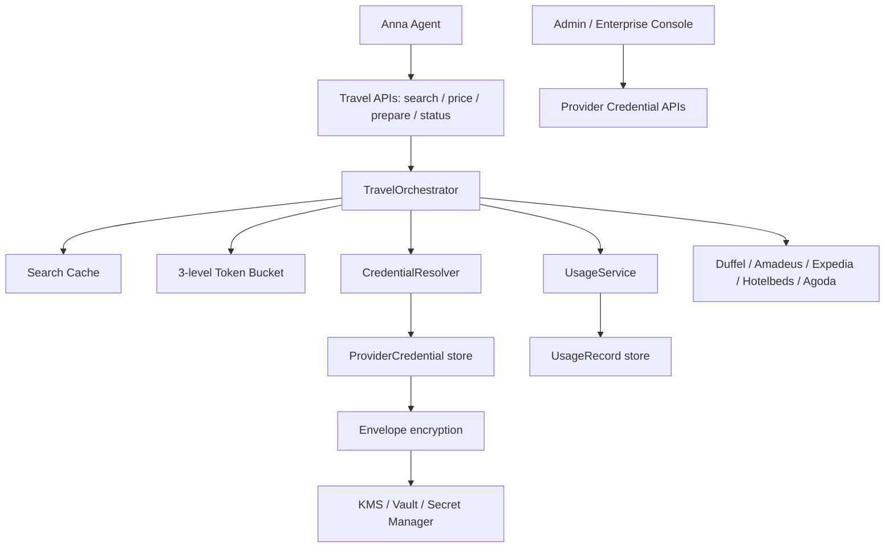

# API Key 管理、限流与成本控制架构

适用范围：Anna 主体个人助理模式中的机票/酒店/支付后端。目标是普通用户默认使用平台共用 Provider Key，企业租户或开发者用户可绑定自己的 BYOK / Connected Provider Account，同时保证 Agent 和前端永远不能读取明文凭据。

## 架构图

## Credential 选择逻辑

`CredentialResolver.resolve(provider, tenantId, userId)` 是 supplier API 调用前的唯一凭据入口。

当前实现顺序：

1. tenant credential：企业租户自己的 provider credential。
2. user credential：开发者用户自己的 provider credential。
3. platform credential：平台统一申请和托管的 provider credential。
4. 全部缺失：返回配置错误。

Agent 不会收到 credential 对象，也不能调用 credential API。TravelProvider 内部只拿到 resolver 返回的后端专用解密结果，controller 不会序列化该结果。

## ProviderCredential 模型

已在 `src/models/types.ts` 创建：

- `id`
- `ownerType: platform | tenant | user`
- `ownerId`
- `provider: duffel | amadeus | expedia | hotelbeds | agoda | stripe | cybersource`
- `mode: sandbox | production`
- `authType: api_key | oauth`
- `encryptedSecret`
- `encryptedRefreshToken`
- `accessTokenExpiresAt`
- `keyVersion`
- `last4`
- `status: active | revoked | expired`
- `createdAt`
- `updatedAt`
- `lastUsedAt`

API 返回使用安全视图，只包含 `id`、`ownerType`、`provider`、`mode`、`last4`、`status`、`lastUsedAt`，不返回 `encryptedSecret`，更不会返回明文 secret。

## 加密策略

本地实现：`LocalEnvelopeEncryptionService` 使用 AES-256-GCM，方便开发和测试。

生产要求：

- 用 KMS / Vault / Secret Manager 做 envelope encryption。
- 数据库只保存 `encryptedSecret` 和 `encryptedRefreshToken`。
- master key 不进入代码库，不进入日志。
- 支持 `revoke`、`rotate`、`delete`，并记录 AuditLog。
- 禁止把 API Key 返回给前端、Agent 或日志系统。

## 三层限流

已实现 `InMemoryTokenBucketRateLimiter`：

- user-level bucket：默认 `RATE_LIMIT_USER_CAPACITY=60`、`RATE_LIMIT_USER_REFILL_PER_SECOND=1`
- tenant-level bucket：默认 `RATE_LIMIT_TENANT_CAPACITY=300`、`RATE_LIMIT_TENANT_REFILL_PER_SECOND=5`
- provider-level bucket：默认 `RATE_LIMIT_PROVIDER_CAPACITY=500`、`RATE_LIMIT_PROVIDER_REFILL_PER_SECOND=8`

生产必须替换为 Redis token bucket，例如 key：

- `ratelimit:user:{userId}`
- `ratelimit:tenant:{tenantId}`
- `ratelimit:provider:{provider}`

内存版只适合单进程开发，不适合多实例部署。

## UsageRecord 与成本控制

已在 `src/models/types.ts` 创建：

- `id`
- `userId`
- `tenantId`
- `provider`
- `endpoint`
- `requestHash`
- `cacheHit`
- `estimatedCostUnit`
- `createdAt`

每次 provider 调用通过 `TravelOrchestrator.providerCall()` 记录 UsageRecord。搜索类 API 通过 `ProviderCacheService` 计算稳定 hash；短时间内相同搜索参数直接复用缓存，记录 `cacheHit: true` 和 `estimatedCostUnit: 0`，避免 Agent 重复消耗供应商搜索额度。

超出套餐额度时返回 HTTP 429，错误码为 `BILLING_REQUIRED`。

## API

Provider credential 后台 API：

- `POST /api/provider-credentials`
- `GET /api/provider-credentials`
- `DELETE /api/provider-credentials/:id`
- `POST /api/provider-credentials/:id/rotate`

Usage API：

- `GET /api/usage/me`
- `GET /api/usage/tenant`

Agent 边界：

- Agent 允许：travel search、price、prepare booking、status。
- Agent 禁止：读取、创建、修改、删除 provider credential；查询后台 usage administration API。
- 请求带 `x-agent: true` 时，credential 和 usage routes 会返回 403。

## 当前代码入口

- 模型：`src/models/types.ts`
- 内存数据库：`src/store/mock-db.ts`
- Credential API：`src/controllers/provider-credential.controller.ts`
- Credential resolver：`src/services/credential-resolver.service.ts`
- Credential service：`src/services/provider-credential.service.ts`
- Envelope encryption：`src/services/envelope-encryption.service.ts`
- Rate limit：`src/services/rate-limit.service.ts`
- Usage：`src/services/usage.service.ts`
- Search cache：`src/services/provider-cache.service.ts`
- Agent 禁止中间件：`src/middleware/deny-agent.middleware.ts`
