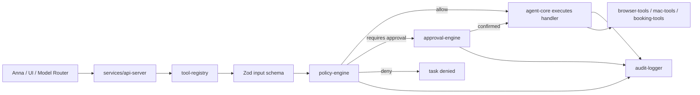

# Anna Controlled Personal Assistant Architecture

## Goal

This backend is a controlled execution layer for Anna personal assistant mode. It does not give a model unrestricted access to the Mac, browser, shell, files, payments, or user accounts.

## Monorepo Layout

- `apps/web-client`: future user-facing task and approval UI.
- `apps/admin-panel`: future registry, policy, approval, and audit admin UI.
- `services/api-server`: Express HTTP API for tasks, approvals, tools, and audit logs.
- `services/agent-server`: future model orchestration service.
- `services/worker`: future async queue worker.
- `services/sandbox-runner`: future constrained Python/code runner.
- `packages/agent-core`: task execution pipeline.
- `packages/policy-engine`: allow, approval, and deny decisions.
- `packages/approval-engine`: approval records and decisions.
- `packages/tool-registry`: registered tool metadata and schema validation.
- `packages/browser-tools`: Playwright browser tools.
- `packages/mac-tools`: allowlisted macOS Shortcuts only.
- `packages/booking-tools`: non-purchasing booking/search helpers.
- `packages/payment-tools`: disabled payment placeholder.
- `packages/audit-logger`: audit sink with memory and PostgreSQL implementations.
- `packages/shared`: shared types, IDs, and errors.
- `infra/docker`: PostgreSQL and Redis local infrastructure.

## Execution Flow

## Anna App Integration Notes

The Anna beginner guide treats an App as a bundle of `app.json`, `manifest.json`, `bundle/`, optional `executas/`, and local fixtures. This backend should be imported into Anna personal assistant mode through that model rather than by giving the model direct OS access.

Recommended first integration path:

1. Keep this controlled backend running locally as the tool control plane.
2. Add a bundled Executa in the Anna personal assistant App that forwards allowed requests to `services/api-server` or the Python FastAPI skeleton.
3. Declare the bundled Executa in `app.json` under `bundled_executas`.
4. Declare the dependency in `manifest.json` under `required_executas`.
5. Keep `manifest.json` permissions narrow. If the UI calls `anna.tools.invoke`, declare `tools.invoke`; if it writes chat messages, declare `chat.write_message`.
6. Keep `ui.host_api` aligned with the exact frontend calls, then run `anna-app validate --strict`.
7. Use `anna-app dev` for local harness testing only after the user confirms any real Anna platform login or API use.

This project intentionally does not call Anna platform APIs by itself. Any future Anna API or platform credential use must be confirmed by the user first.

## Local Matrix Command Panel

`08-personal-assistant-anna-app` exposes `GET /matrix` as a local command panel for development. It is deliberately not a general terminal.

Allowed command IDs:

- `controlled-api.build`
- `controlled-api.start`
- `python-agent.validate`
- `python-agent.start`

The server executes these with `spawn(..., { shell: false })`, fixed `cwd`, fixed argument lists, and no user-provided command text. This is intended to help Codex and the user start the controlled backends without introducing unrestricted computer control.

## Data Stores

- PostgreSQL stores durable `audit_logs` when `DATABASE_URL` is configured.
- Redis is reserved for queues, rate limits, and distributed locks in the next phase.
- The first task and approval store is in-memory so the control plane can be tested locally before adding persistence.

## First Tool Set

- `browser.open`: low risk, opens a URL through Playwright.
- `browser.click`: medium risk, requires approval.
- `browser.type`: medium risk, requires approval.
- `browser.screenshot`: medium risk, requires approval.
- `mac.shortcut.run`: high risk, requires approval and must be listed in `ANNA_ALLOWED_SHORTCUTS`.
- `booking.search`: low risk, prepares search criteria only.
- `payment.capture`: critical risk, always denied by policy.
